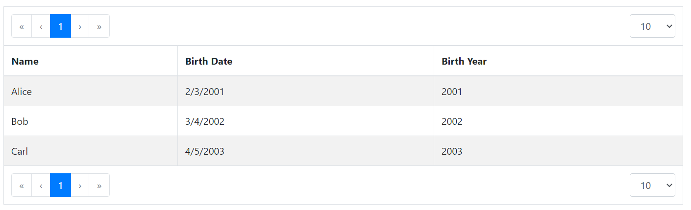

# @vlsergey/react-bootstrap-pagetable

Ready-to-use-in-SPA table component

[![NPM version][npm-image]][npm-url]
[![Build Status][travis-image]][travis-url]
[![Downloads][downloads-image]][downloads-url]

Goal of this component is provide standard and simple-to-use component to display and operate over data presented in tables. Such data are usually provided by server side using some `find...` methods with `page` and `size` arguments, as well as filtering, sorting and other options.

Online demo: [HERE](https://vlsergey.github.io/react-bootstrap-pagetable/)

Features:
* Display and navigate over pages of data
* Change size of page
* Allow actions to be executed with elements (with or without autorefresh after action completed).
* Allow selecting multiple elements and execute single action over them
* (TODO) "Select all" checkbox
* (TODO) server-side sorting (i.e. passing `sort` argument to server)
* (TODO) server-side filtering
* (TODO) support standard renderers for date, time and other OpenAPI types
* (TODO) examples of custom field types with custom renderers (color)  
* (TODO) Allow to change visibility and order of columns to be displayed

## API

Installation:
```
npm install --save @vlsergey/react-bootstrap-pagetable
```

Main component is exposed as default module export of library.
There are 2 main properties to define. First is `itemModel` -- defines the data
structure, how to display data. Second is `fetch` -- provides implementation
of method to query data from server (or memory).

### Item model
So far itemModel (`itemModel : ItemModel`) defines 2 properties:

* `idF` (`idF: (item : T) => string`). Defines a way to get unique
identifier of object in the data list. It's usually object ID. Identifier
*should* be unique in single data page scope and *shall* be unique in whole
table scope. Internally it's used to store selected rows identifiers and to
provide `key` to React element array items.
* `fields (fields: FieldModel<unknown>[])`. List of object properties that can
be displayed in the table. Until version 1.0 every listed column is visible and
order can't be change. This is subject to change. In future versions user will
be able to hide some columns and/or to reorder them. Each field model should
have following properties:
  * `key` (`key: string`). Defines internal string key for field. Internally
  it's used to provide `key` to React element array items. In future versions
  it will also be used to store 'shown/hidden' lists of column. Assumed to be
  safe to change from version to version (nothing really bad happens on change).
  * `title` (`title : ReactNode`). What shall be shown as column title in header
  cell or in the column list in settings dialog popup. Note: `string` can be
  used as `ReactNode`, so feel free to provide just plain text.
  * `description` (`description? : ReactNode`): Description of field. Currently
  unused.
  * `getter` (`getter? : ( item : unknown, fieldModel : FieldModel<V> ) => V`).
  _Optional_. Defines the way to obtain field value from object structure. By
  default obtains object property using `key`, i.e. `item[fieldModel.key]`.
  * `render` (`render : ( value : V, item : unknown ) => ReactNode`). _Optional_.
  Defines the way to render object field as table cell content. By default
  just outputs value as `ReactNode`.
    > Subject to change. In future versions by default any non-number and
    non-string value will be converted to string using `JSON.stringify()` method.
    So it will be easier to catch rendering problems and still provide some kind
     of "display" to user.

  * `headerCellProps` (`headerCellProps?: ( fieldModel : FieldModel<V> ) => Record<string, unknown>`).
  _Optional_. Provides additional header cell react element (`<th>`) properties.
  By default no additional properties are provided. Header cell is still styled
  using default bootstrap styles of `<Table>` component.
  * `valueCellProps` (`valueCellProps?: ( value : V, item : unknown, fieldModel : FieldModel<V> ) => Record<string, unknown>`).
  _Optional_. Provides additional value cell react element (`<td>`) properties.

#### Example

Data example:
```json
[
  { "id": "1", "name": "Alice", "birthday": "2001-02-03" },
  { "id": "2", "name": "Bob", "birthday": "2002-03-04" },
  { "id": "3", "name": "Carl", "birthday": "2003-04-05" }
]
```

Possible item model:
```javascript
const itemModel = {
  idF: ( { id } ) => id,
  fields: [
    { key: 'name', title: 'Name' },
    {
      key: 'birthday',
      title: 'Birth Date',
      render: ( value ) => new Date( Date.parse( value ) ).toLocaleDateString(),
    },
    {
      key: 'birthyear',
      title: 'Birth Year',
      getter: ( { birthday } ) => new Date( Date.parse( birthday ) ).getFullYear(),
    },
  ]
}
```



### fetch()

```javascript
fetch: ( fetchArgs: FetchArgs ) => Promise<Page<T>>

interface FetchArgs {
  /** 0-based page to fetch */
  page: number,
  /** Max number of items per page to fetch */
  size: number,
}

/**
* Structure of type is same as Spring Data Page type, thus server result
* can be pass to PageTable without transformation.
*/
interface Page<T> {
  content : T[];
  empty : boolean;
  first : boolean;
  hasContent : boolean;
  hasNext : boolean;
  hasPrevious : boolean;
  last : boolean;
  number : number;
  numberOfElements : number;
  size : number;
  totalElements : number;
  totalPages : number;
}
```
Provides a way to get items to display. User shall not think about bouncing/scheduling/etc,
just provide data fetch implementation. `page` field is 0-based.

[npm-image]: https://img.shields.io/npm/v/@vlsergey/react-bootstrap-pagetable.svg?style=flat-square
[npm-url]: https://npmjs.org/package/@vlsergey/react-bootstrap-pagetable
[travis-image]: https://travis-ci.com/vlsergey/react-bootstrap-pagetable.svg?branch=master
[travis-url]: https://travis-ci.com/vlsergey/react-bootstrap-pagetable
[downloads-image]: http://img.shields.io/npm/dm/@vlsergey/react-bootstrap-pagetable.svg?style=flat-square
[downloads-url]: https://npmjs.org/package/@vlsergey/react-bootstrap-pagetable
